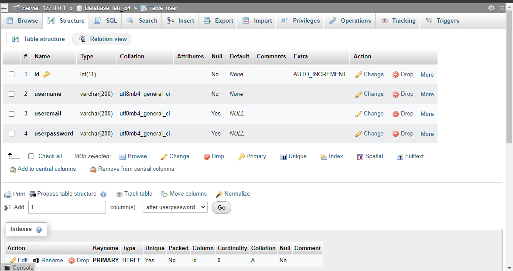
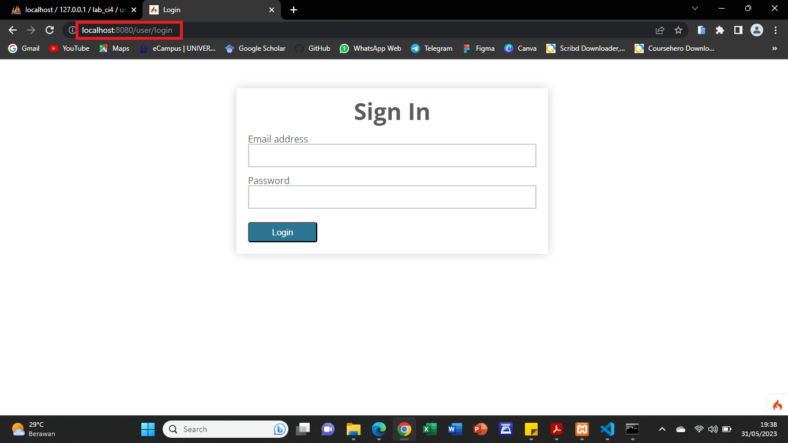
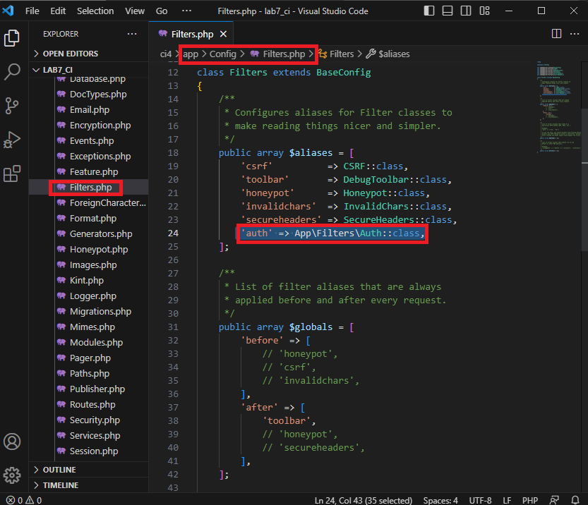
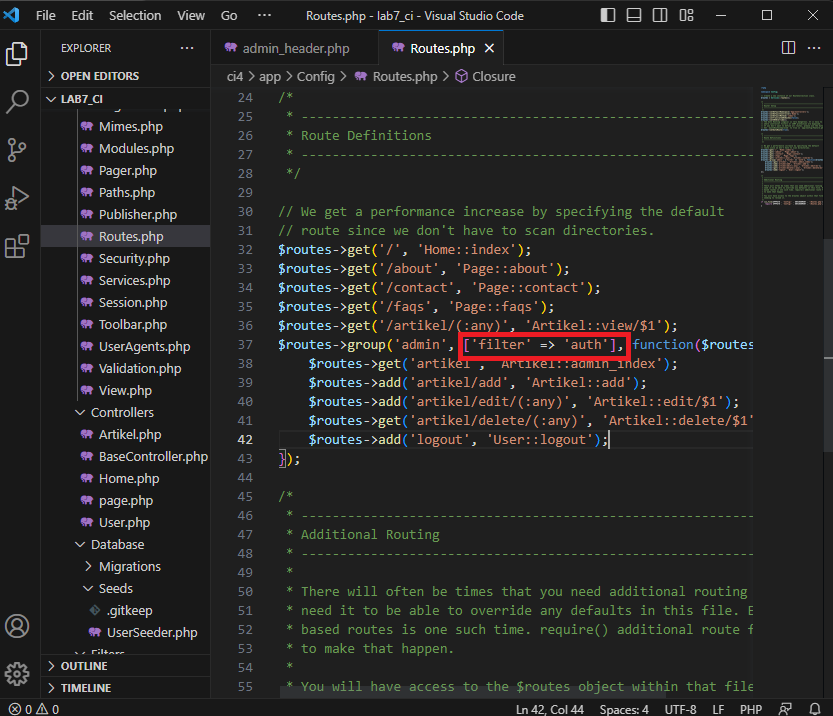
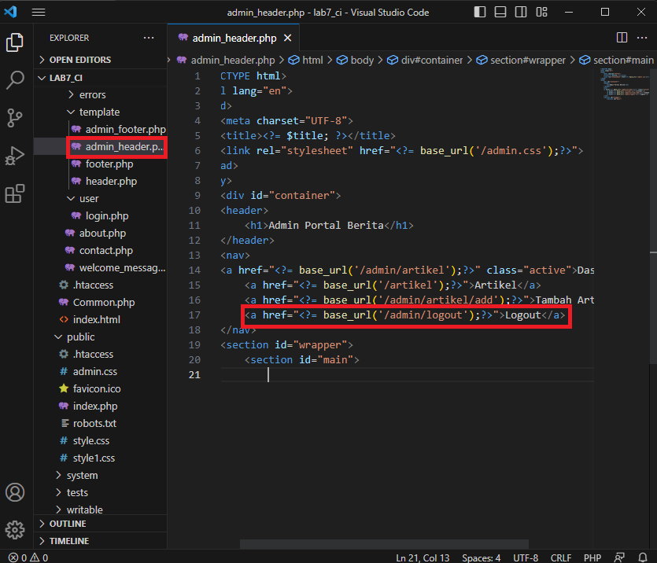
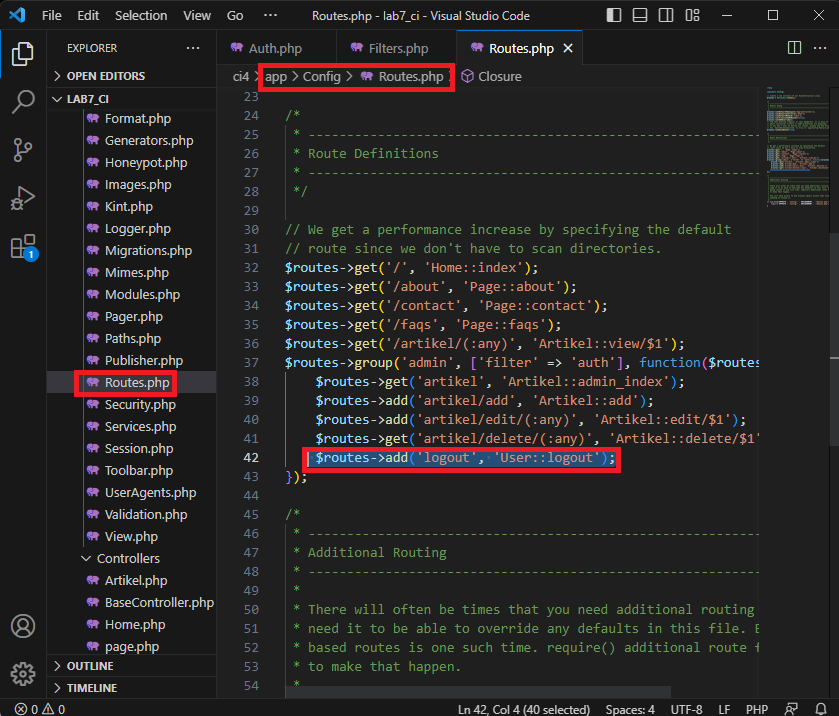
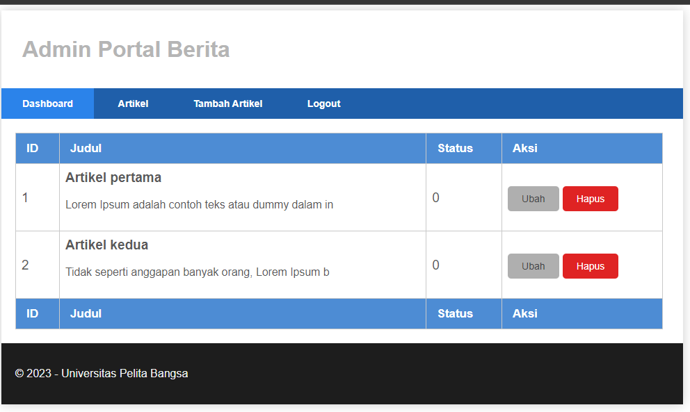

# Praktikum9

## A. Membuat Tabel: User Login

Membuat tabel baru dengan nama **user** di dalam database **lab_ci4**.

```mySQL
    CREATE TABLE user ( 
        id INT(11) auto_increment, 
        username VARCHAR(200) NOT NULL, 
        useremail VARCHAR(200), 
        userpassword VARCHAR(200), PRIMARY KEY(id) 
        );
```




## B. Membuat Model User

Selanjutnya adalah membuat Model untuk memproses data login. Buat file baru pada direktori **app/Models** dengan nama **UserModel.php**.

```php
    <?php 
    
    namespace App\Models; 
    use CodeIgniter\Model; 
    class UserModel extends Model
    {
    protected $table = 'user';
    protected $primaryKey = 'id';
    protected $useAutoIncrement = true;
    protected $allowedFields = ['username', 'useremail', 'userpassword'];
    }
```

## C. Membuat Controller User

Buat Controller baru dengan nama **User.php** pada direktori **app/Controllers**. Kemudian tambahkan
method **index()** untuk menampilkan daftar user, dan method **login()** untuk proses login.

```php
    <?php
    namespace App\Controllers;
    use App\Models\UserModel;
    class User extends BaseController
    {
    public function index()
    {
        $title = 'Daftar User';
        $model = new UserModel();
        $users = $model->findAll();
        return view('user/index', compact('users', 'title'));
    }
    public function login()
    {
        helper(['form']);
        $email = $this->request->getPost('email');
        $password = $this->request->getPost('password');
        if (!$email)
        {
            return view('user/login');
        }
        $session = session();
        $model = new UserModel();
        $login = $model->where('useremail', $email)->first();
        if ($login)
        {
            $pass = $login['userpassword'];
            if (password_verify($password, $pass))
            {
                $login_data = [
                    'user_id' => $login['id'],
                    'user_name' => $login['username'],
                    'user_email' => $login['useremail'], 'logged_in' => TRUE, 
                ]; 
                $session->set($login_data); 
                return redirect('admin/artikel'); 
            } else { 
                $session->setFlashdata("flash_msg", "Password salah."); 
                return redirect()->to('/user/login'); 
            } 
        } else { $session->setFlashdata("flash_msg", "email tidak terdaftar."); return redirect()->to('/user/login'); 
        } 
    } 
    }
```

## D. Membuat View Login

Buat direktori baru dengan nama **user** pada direktori **app/views**, kemudian buat file baru dengan nama **login.php**.

```php
    <!DOCTYPE html> 
    <html lang="en"> 
    <head> 
        <meta charset="UTF-8"> 
        <title>Login</title> 
        <link rel="stylesheet" href="<?= base_url('/style.css');?>"> 
    </head> 
    <body> 
        <div id="login-wrapper"> 
            <h1>Sign In</h1> 
            <?php if(session()->getFlashdata('flash_msg')):?> 
                <div class="alert alert-danger"><?= session()->getFlashdata('flash_msg') ?></div> 
            <?php endif;?> 
            <form action="" method="post"> 
                <div class="mb-3"> 
                    <label for="InputForEmail" class="form-label">Email address</label> <input type="email" name="email" class="form-control" id="InputForEmail" value="<?= set_value('email') ?>"> 
                </div> 
                <div class="mb-3"> 
                    <label for="InputForPassword" class="form-label">Password</label>
                    <input type="password" name="password" class="form-control" id="InputForPassword"> 
                </div> 
                <button type="submit" class="btn btn-primary">Login</button> 
            </form> 
        </div> 
    </body> 
    </html>
```

## E. Membuat Database Seeder

Database seeder digunakan untuk membuat data dummy. Untuk keperluan ujicoba modul login, kita perlu memasukkan data user dan password ke dalam database. Untuk itu buat database seeder untuk tabel user. Buka CLI, kemudian tulis perintah berikut:

`php spark make:seeder UserSeeder`


* Selanjutnya, buka file **UserSeeder.php** yang berada di lokasi direktori **/app/Database/Seeds/UserSeeder.php** kemudian isi dengan kode berikut:

    ```php
        <?php 
        namespace App\Database\Seeds; 
        use CodeIgniter\Database\Seeder; 
        class UserSeeder extends Seeder 
        { 
            public function run() 
            { 
                $model = model('UserModel'); 
                $model->insert([ 'username' => 'admin', 'useremail' => 'admin@email.com', 'userpassword' => password_hash('admin123', PASSWORD_DEFAULT), 
                ]); 
            } 
        }
    ```

* Selanjutnya buka kembali CLI dan ketik perintah berikut:

    `php spark db:seed UserSeeder`

* Tambahkan CSS untuk mempercantik tampilan login. Buka file **style.css** pada direktori **ci4\public\style.css**.

* Selanjutnya buka url http://localhost:8080/user/login seperti berikut:




## F. Menambahkan Auth Filter

* Selanjutnya membuat filer untuk halaman admin. Buat file baru dengan nama **Auth.php** pada direktori **app/Filters**.

    ```php
        <?php namespace App\Filters; 
        
        use CodeIgniter\HTTP\RequestInterface; 
        use CodeIgniter\HTTP\ResponseInterface; 
        use CodeIgniter\Filters\FilterInterface; 
        
        class Auth implements FilterInterface 
        { 
            public function before(RequestInterface $request, $arguments = null) 
            { 
                // jika user belum login 
                if(! session()->get('logged_in')){ 
                    // maka redirct ke halaman login 
                    return redirect()->to('/user/login'); 
                } 
            } 
            public function after(RequestInterface $request, ResponseInterface $response, $arguments = null) { 
                // Do something here 
            } 
        }
    ```

* Selanjutnya buka file **app/Config/Filters.php** tambahkan kode berikut:

    `'auth' => App\Filters\Auth::class`




* Selanjutnya buka file **app/Config/Routes.php** dan sesuaikan kodenya.




## G. Fungsi Logout

* Tambahkan method logout pada **Controllers/User.php** seperti berikut:

```php
    public function logout()
    {
        session()->destroy();
        return redirect()->to('/user/login');
    }
```

* Tambahkan menu logout diheader admin. Ke direktori **app/views/template** lalu buka file **admin_header.php** tambahkan kode berikut.

    `<a href="<?= base_url('/admin/logout');?>">Logout</a>`




* Dan Tambahkan route logout dengan cara ke direktori **app/Config/Routes.php** lalu tambahkan kode berikut.

    `$routes->add('logout', 'User::logout');`




## H. Percobaan Akses Menu Admin

* Buka url http://localhost:8080/admin/artikel pada browser.


